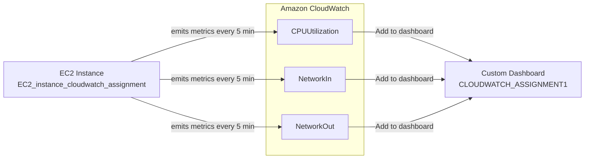

# Case Study: CloudWatch Dashboard — Monitoring EC2 CPU & Network

## 📋 Problem Statement

XYZ Corporation needs to monitor the EC2 machines created by its users for errors or misconfigurations, in addition to managing user identity and access. This case study covers:

1. Creating a **CloudWatch dashboard** that lets you check **CPU utilization** and **networking** (NetworkIn / NetworkOut) for a particular EC2 instance

---

## 🏗️ Architecture

### Metric flow: EC2 → CloudWatch → Dashboard

> This diagram renders automatically on GitHub via Mermaid — no image hosting required.

---

## 📖 Theory

### How CloudWatch metrics work

Amazon EC2 automatically publishes a standard set of metrics to **CloudWatch** for every running instance, without any additional agent installation — this is called **basic monitoring** (5-minute granularity by default; 1-minute with "detailed monitoring" enabled). Each metric is identified by:

- **Namespace** — the AWS service the metric belongs to (`AWS/EC2` in this case)
- **Metric name** — e.g. `CPUUtilization`, `NetworkIn`, `NetworkOut`
- **Dimension** — the specific resource the metric applies to, e.g. `InstanceId = i-0385c2b016c1fcb3a`
- **Statistic** — how raw data points are aggregated over a period (`Average`, `Sum`, `Maximum`, `Minimum`, etc.)
- **Period** — the time granularity of aggregation (e.g. 5 minutes)

The three metrics used in this assignment:

| Metric | What it measures |
|---|---|
| `CPUUtilization` | Percentage of allocated compute capacity currently in use |
| `NetworkIn` | Bytes received by the instance's network interfaces |
| `NetworkOut` | Bytes sent by the instance's network interfaces |

### Dashboards and widgets

A **CloudWatch Dashboard** is a customizable, persistent home page in the console made up of **widgets** — each widget renders one or more metrics as a graph (line, stacked area, number, etc.). Dashboards let you combine metrics from different services (EC2, RDS, Lambda, custom metrics) into a single view, which is far more efficient for day-to-day monitoring than browsing the raw metrics catalog every time.

Key behavior worth understanding:

- Widgets are added via **"Add to dashboard"** directly from a metrics graph, or built manually inside the dashboard editor.
- Changes to a dashboard are **not saved automatically** — you must explicitly click **Save dashboard**, or edits/added widgets are lost on refresh.
- Each widget can independently set its own time range, or **inherit the dashboard's global time range** — useful for comparing metrics side-by-side over the same window.
- Dashboards can mix metrics from multiple instances/resources in one graph (e.g. "CPU utilization of EC2 instances sorted by highest"), which is handy for fleet-wide comparisons, not just single-instance monitoring.

---

## 🛠️ Steps to Reproduce

### Part 1 — Launch the EC2 instance to monitor

1. In the **EC2 console**, launch an instance (e.g. Amazon Linux 2023, `t3.micro`), naming it something identifiable like `EC2_instance_cloudwatch_assignment`.
2. Create or select a key pair, and launch. Confirm the instance reaches the `Running` state and note its **Instance ID**.

### Part 2 — Build the dashboard

3. Open **CloudWatch → Dashboards → Custom Dashboards** (you'll see it's empty initially).
4. Instead of creating the dashboard shell first, go to **CloudWatch → Metrics → All metrics**, then browse into **EC2 → Per-Instance Metrics**.
5. Use the **Actions → EC2 → "CPU utilization of EC2 instances sorted by highest"** quick-start query (or manually search/select), then filter down to the specific instance ID.
6. In the resulting metrics table, check the boxes for:
   - `CPUUtilization`
   - `NetworkIn`
   - `NetworkOut`
7. With the graph populated, click **Actions → Add to dashboard**.
8. In the "Add to dashboard" dialog:
   - Select **Create new** (or an existing dashboard) and name it, e.g. `CLOUDWATCH_ASSIGNMENT1`
   - Choose **Widget type**: `Line`
   - Optionally customize the widget title (e.g. "CPU utilization of EC2 instances sorted by highest")
   - Click **Add to dashboard**
9. *(Optional, as done in this assignment)* Add separate, focused widgets too — one isolating just `CPUUtilization`, and another isolating just `NetworkIn`/`NetworkOut` — by repeating steps 5–8 with a narrower metric selection each time. This gives cleaner, single-purpose graphs alongside the combined view.
10. Click **Save dashboard** to persist all added widgets — until this is clicked, AWS explicitly warns the changes aren't saved.
11. Verify the final dashboard shows CPU utilization and network in/out for the target instance, refreshing correctly across the selected time range (e.g. last 3 hours).

---

## 💡 Use Cases

- **Operational visibility** — a single-pane-of-glass view of an instance's health (CPU + network) without digging through the metrics catalog each time
- **Troubleshooting performance issues** — quickly correlate a CPU spike with a network traffic spike to diagnose whether load is compute-bound or I/O-bound
- **Capacity planning** — observing sustained CPU/network trends over days or weeks (`1w` time range) to decide if an instance needs to be resized
- **Incident response** — during an outage or slowdown, a pre-built dashboard means responders don't waste time building graphs from scratch under pressure
- **Foundation for alerting** — the same metrics browsed here (`CPUUtilization`, `NetworkIn`, `NetworkOut`) are exactly what CloudWatch **Alarms** are built on, so this dashboard doubles as a preview of what alarm thresholds should watch
- **Multi-resource fleet views** — the same widget pattern extends naturally to comparing CPU across an entire Auto Scaling Group or fleet of instances, not just one machine

---

## ⚠️ Notes & Best Practices

- **Remember to click Save**: CloudWatch dashboards do not autosave by default (note the "Autosave: Off" indicator) — added widgets are lost if you navigate away without saving.
- **Enable detailed monitoring** (1-minute granularity) for instances where 5-minute basic monitoring isn't responsive enough for troubleshooting — this incurs a small additional cost.
- **Use dynamic labels**: CloudWatch supports dynamic widget labels (e.g. showing the current/average value inline) which make dashboards easier to read at a glance without hovering.
- **Pair with alarms**: once metrics are being tracked here, consider creating **CloudWatch Alarms** on `CPUUtilization` (e.g. alert above 80%) so issues are surfaced proactively instead of only being visible when someone opens the dashboard.
- **Time range consistency**: when comparing widgets, keep them on a consistent time range (either by using the dashboard's global range or explicitly persisting a widget's range) to avoid misleading side-by-side comparisons.
- **Cost awareness**: custom dashboards beyond the free tier (3 dashboards, 50 metrics each per month) incur charges — consolidate related metrics into fewer, well-organized dashboards rather than creating many small ones.

---

## 📎 Resources

- [Amazon CloudWatch dashboards documentation](https://docs.aws.amazon.com/AmazonCloudWatch/latest/monitoring/CloudWatch_Dashboards.html)
- [EC2 CloudWatch metrics reference](https://docs.aws.amazon.com/AWSEC2/latest/UserGuide/viewing_metrics_with_cloudwatch.html)
- [CloudWatch Alarms documentation](https://docs.aws.amazon.com/AmazonCloudWatch/latest/monitoring/AlarmThatSendsEmail.html)

