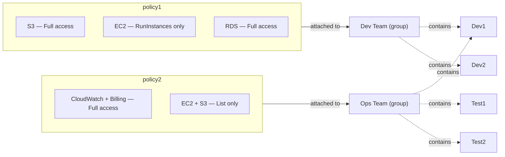

# Case Study: IAM Policies — Scoped Permissions for Dev & Ops Teams

## 📋 Problem Statement

XYZ Corporation needs to maintain the security of its AWS account by giving each team exactly the permissions their job function requires — nothing more. This case study covers:

1. Creating **policy1**, which allows:
   - Complete access to **S3**
   - **Only** creating EC2 instances (`ec2:RunInstances`)
   - Full access to **RDS**
2. Creating **policy2**, which allows:
   - Complete access to **CloudWatch** and **Billing**
   - Only **listing** EC2 and S3 resources
3. Attaching **policy1** to the `Dev Team` group (from the [IAM Users assignment](../iam-users-assignment/README.md))
4. Attaching **policy2** to the `Ops Team` group

---

## 🏗️ Architecture

### Policy → group mapping



> `Dev1` is a member of both groups (from the IAM Users assignment), so it ends up with the **union** of policy1 and policy2's permissions. This diagram renders automatically on GitHub via Mermaid.

---

## 📖 Theory

### Customer-managed policies

An **IAM policy** is a JSON document that defines permissions — which actions are allowed or denied, on which resources, under which conditions. AWS provides two ways to build one:

- **Visual editor** — pick a service, then pick actions from AWS's categorized **access levels**: `List`, `Read`, `Write`, `Permissions management`, and `Tagging`. This is what was used here (e.g. selecting "All S3 actions" for full access, or just `RunInstances` under EC2's Write category).
- **JSON editor** — write or paste the policy document directly for precise control.

A **customer-managed policy** (as opposed to an AWS-managed policy like `AmazonS3FullAccess`) is one you author yourself, giving you full control over exactly which actions are included — which is why this assignment creates two custom policies rather than reusing pre-built ones.

### What each policy actually grants

**policy1** (equivalent JSON):
```json
{
  "Version": "2012-10-17",
  "Statement": [
    { "Effect": "Allow", "Action": "s3:*", "Resource": "*" },
    { "Effect": "Allow", "Action": "ec2:RunInstances", "Resource": "*" },
    { "Effect": "Allow", "Action": "rds:*", "Resource": "*" }
  ]
}
```
Note the EC2 statement: it grants **only** `RunInstances`, not full EC2 access. In the AWS console, selecting a single action like this triggers a **"Dependent permissions not selected"** warning — `RunInstances` typically needs a few companion actions (e.g. permissions on the AMI, key pair, or security group) to fully succeed depending on how restrictively the account is configured. This is a deliberate constraint in the assignment: Dev Team can *launch* instances but can't stop, terminate, modify, or otherwise manage them.

**policy2** (equivalent JSON):
```json
{
  "Version": "2012-10-17",
  "Statement": [
    { "Effect": "Allow", "Action": "cloudwatch:*", "Resource": "*" },
    { "Effect": "Allow", "Action": "billing:*", "Resource": "*" },
    {
      "Effect": "Allow",
      "Action": ["ec2:Describe*", "s3:List*", "s3:GetBucketLocation"],
      "Resource": "*"
    }
  ]
}
```
Ops Team gets full observability and cost visibility (CloudWatch + Billing), but only **read/list-level** visibility into EC2 and S3 — enough to monitor what exists, without the ability to modify or delete resources.

### Why attach policies to groups, not users

Both policies are attached to **groups**, not individual users — reinforcing the same principle from the IAM Users assignment: manage permissions once per job function, and let group membership determine what each person can do. If a policy needs to change (e.g. Dev Team also needs S3 lifecycle management), it's updated in one place and instantly applies to every member.

---

## 🛠️ Steps to Reproduce

### Create policy1

1. **IAM console → Policies → Create policy**.
2. In the **visual editor**, add the **S3** service → check **All S3 actions** (`s3:*`) → Allow.
3. **Add more permissions** → select **EC2** → under **Write**, check only **RunInstances** → Allow. (Acknowledge the dependent-permissions warning if it appears, since the assignment intentionally scopes this to just the launch action.)
4. **Add more permissions** → select **RDS** → check **All RDS actions** (`rds:*`) → Allow.
5. **Next** → name the policy `policy1` → **Create policy**.

### Create policy2

6. **IAM console → Policies → Create policy**.
7. Add **CloudWatch** → check **All CloudWatch actions** → Allow.
8. **Add more permissions** → add **Billing** → check **All Billing actions** → Allow.
9. **Add more permissions** → add **EC2** → under **List**, select the list/describe-level actions only → Allow.
10. **Add more permissions** → add **S3** → under **List**, select the list-level actions only → Allow.
11. **Next** → name the policy `policy2` → **Create policy**.

### Attach policies to groups

12. From **Policies**, search for `policy1` → select it → **Actions → Attach**.
13. Filter entities by **User groups**, check **DEVTEAM** → **Attach policy**.
14. From **Policies**, search for `policy2` → select it → **Actions → Attach**.
15. Filter entities by **User groups**, check **OPSTEAM** → **Attach policy**.
16. Verify: open **Dev Team → Permissions** and confirm `policy1` is listed; open **Ops Team → Permissions** and confirm `policy2` is listed.

---

## 💡 Use Cases

- **Least-privilege job functions** — developers get what they need to build (S3 + launch EC2 + RDS) without being able to tear down infrastructure; operations get visibility (CloudWatch, billing, inventory) without being able to modify resources
- **Cost governance** — restricting full Billing access to Ops Team keeps cost management centralized to the team responsible for it
- **Guardrails against accidental damage** — limiting Dev Team's EC2 permissions to `RunInstances` prevents developers from accidentally terminating or modifying shared infrastructure
- **Read-only monitoring roles** — the List-only pattern for Ops Team's EC2/S3 access is a common template for building auditor or monitoring-only permission sets
- **Reusable permission building blocks** — customer-managed policies like `policy1`/`policy2` can be attached to additional groups or roles later without being rewritten

---

## ⚠️ Notes & Best Practices

- **Dependent permissions**: when scoping an action tightly (like `ec2:RunInstances` alone), test it end-to-end — AWS often flags "dependent permissions not selected," and you may need companion `Describe*` or resource-specific actions for the primary action to succeed in practice.
- **Avoid wildcard resources where possible**: this assignment uses `"Resource": "*"` for simplicity, but production policies should scope `Resource` to specific ARNs wherever feasible to reduce blast radius.
- **Review with IAM Access Analyzer**: after attaching policies, use Access Analyzer's policy validation to catch overly permissive statements or security warnings (the console already flags some of these, like the "all wildcard `*` may be overly permissive" note seen during creation).
- **Naming conventions**: descriptive names (`policy1`/`policy2` here are assignment-specific; in production prefer names like `DevTeam-S3-EC2Launch-RDS-Access`) make policies easier to audit at scale.
- **Version policies deliberately**: IAM keeps up to 5 versions of a customer-managed policy — use this to review changes over time rather than editing blindly.

---

## 📎 Resources

- [IAM Policies documentation](https://docs.aws.amazon.com/IAM/latest/UserGuide/access_policies.html)
- [IAM policy visual editor](https://docs.aws.amazon.com/IAM/latest/UserGuide/access_policies_create-console.html)
- [IAM Access Analyzer policy validation](https://docs.aws.amazon.com/IAM/latest/UserGuide/access-analyzer-policy-validation.html)

