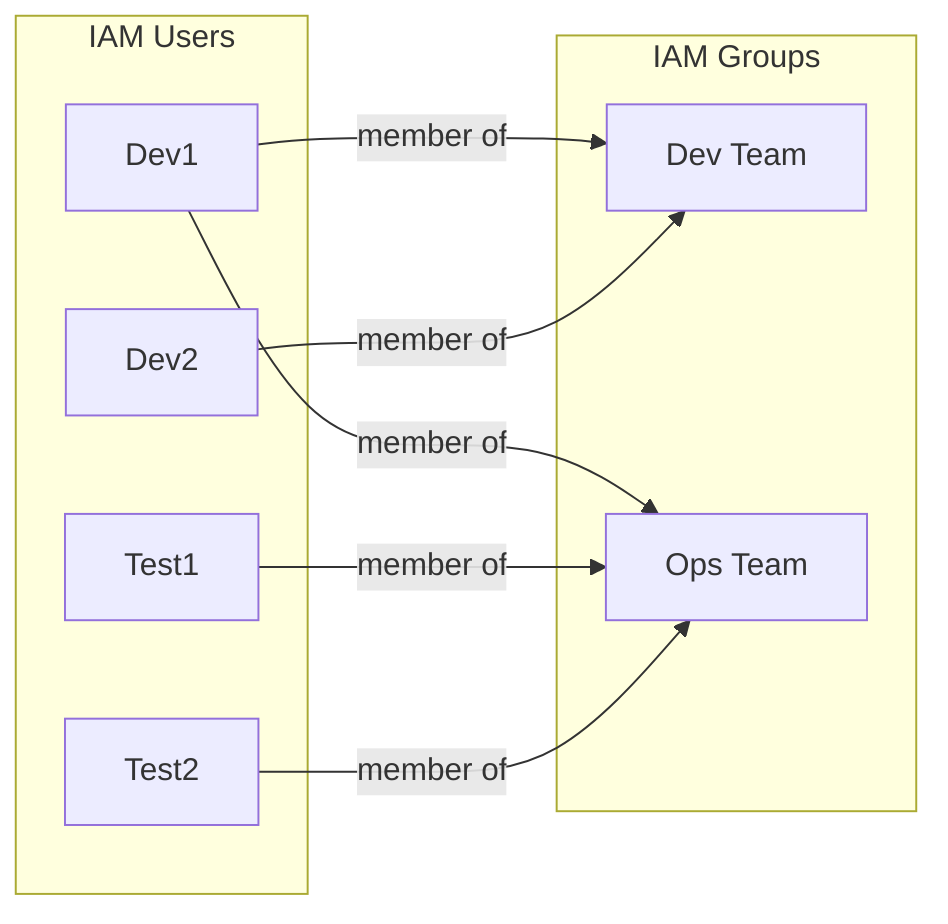

# Case Study: IAM Users & Groups

## 📋 Problem Statement

XYZ Corporation needs to maintain the security of its AWS account and resources by implementing a solution that makes it easy to recognize and monitor different users. This case study covers:

1. Creating 4 IAM users: `Dev1`, `Dev2`, `Test1`, `Test2`
2. Creating 2 IAM groups: `Dev Team`, `Ops Team`
3. Adding `Dev1` and `Dev2` to `Dev Team`
4. Adding `Dev1`, `Test1`, and `Test2` to `Ops Team`

---

## 🏗️ Architecture

### User-to-group membership

> Note: `Dev1` belongs to **both** groups, so it inherits the permissions of `Dev Team` and `Ops Team` combined. GitHub renders this diagram automatically since it natively supports Mermaid in Markdown.

---

## 📖 Theory

### IAM users, groups, and why groups matter

An **IAM user** is a unique identity within an AWS account, representing a person or application that needs to interact with AWS resources. Each user can have its own credentials (console password and/or access keys) and is billed/audited individually.

An **IAM group** is a collection of users. Groups don't have credentials of their own — they exist purely to attach **policies** (permissions) once and have those permissions apply to every member automatically. This is the AWS-recommended best practice over attaching policies directly to individual users, because it:

- Centralizes permission management — update the group's policy once, and every member is affected
- Simplifies onboarding/offboarding — add or remove a user from a group instead of rewriting individual permissions
- Reduces the chance of permission drift, where users accumulate inconsistent, hard-to-audit individual policies over time
- Supports **least privilege**, since job-function groups (`Dev Team`, `Ops Team`) can be scoped to exactly what that function needs

A user can belong to **multiple groups simultaneously**, and their effective permissions are the union of all attached policies across every group they belong to (plus any directly attached policies) — this is why `Dev1` in this assignment ends up with the combined permissions of both `Dev Team` and `Ops Team`.

---

## 🛠️ Steps to Reproduce

1. Sign in to the **IAM console** → **Users** → **Create user**.
2. Enter the user name (`Dev1`, `Dev2`, `Test1`, or `Test2`), and repeat for each of the 4 users. Console access is optional depending on whether the user needs to log into the AWS Management Console.
3. During user creation (or afterward via **User groups**), create the two groups:
   - **Dev Team** — via **Create group** on the "Set permissions" step, or under **User groups → Create group**
   - **Ops Team** — same process
4. Assign group membership:
   - Add `Dev1` and `Dev2` to **Dev Team**
   - Add `Dev1`, `Test1`, and `Test2` to **Ops Team**
5. Review and create each user, confirming the correct groups are checked in the "User groups" step.
6. Verify from **IAM → User groups → Dev Team** that it shows 2 users, and **Ops Team** shows 3 users.
7. *(Optional but recommended)* Attach appropriate managed or custom policies to each group based on job function (e.g. read/write access to specific services for `Dev Team`, monitoring/operational access for `Ops Team`) so the groups aren't just organizational, but functionally scoped.

---

## 💡 Use Cases

- **Team-based access control** — grant permissions once per team/function instead of per person, reducing manual policy management
- **Simplified onboarding and offboarding** — add a new hire to the right group on day one, or remove a departing employee from all groups in one action to instantly revoke access
- **Separation of duties** — keep development and operations permissions distinct, even when (as with `Dev1`) an individual needs access to both
- **Auditing and compliance** — IAM Access Analyzer and group membership make it straightforward to answer "who can do what" during a security review
- **Consistent permission baselines** — new team members automatically get the same access level as their peers by joining the same group, avoiding inconsistent one-off grants

---

## ⚠️ Notes & Best Practices

- **Don't attach policies directly to users** — attach them to groups instead, and manage membership. This assignment sets up the group structure; the next step in a real environment is attaching least-privilege policies to `Dev Team` and `Ops Team`.
- **Enable MFA** for any IAM user with console access, especially those in privileged groups.
- **Use IAM Identity Center (successor to AWS SSO)** for larger organizations instead of individual IAM users, where practical — it centralizes identity across multiple AWS accounts.
- **Review Access Analyzer periodically** to catch unused permissions or unintended external access.
- **Naming conventions**: consistent group names (`Dev Team`, `Ops Team`) make policies and IAM Access Analyzer findings easier to read at scale.

---

## 📎 Resources

- [IAM Users documentation](https://docs.aws.amazon.com/IAM/latest/UserGuide/id_users.html)
- [IAM Groups documentation](https://docs.aws.amazon.com/IAM/latest/UserGuide/id_groups.html)
- [IAM best practices](https://docs.aws.amazon.com/IAM/latest/UserGuide/best-practices.html)

